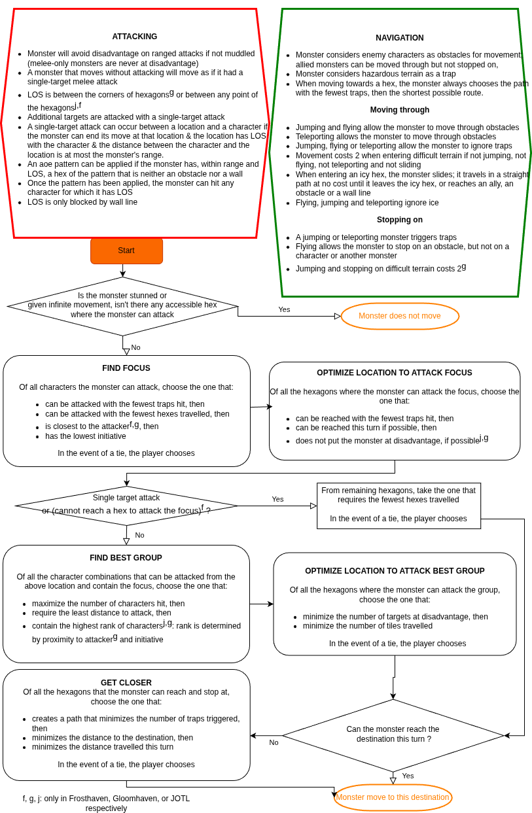

# gloom
Gloomhaven Monster Mover

https://gloom.aluminumangel.org/

This is a fork maintained by [Toucan4Life](https://github.com/Toucan4Life), based on the
original project created by [Daniel Nelson (AluminumAngel)](https://github.com/AluminumAngel/gloom),
who did all the original work. All credit for the initial implementation goes to him.

Flowchart can be edited with the help of draw.io (https://app.diagrams.net/) to rectify errors or enhance resolution or be printed with the help of the file "GloomIA_Flowchart.drawio"

  